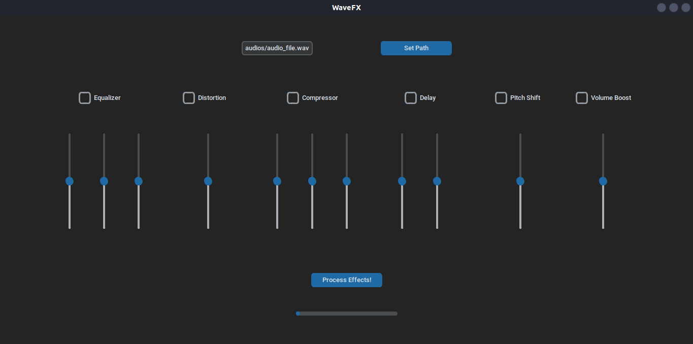

# WaveFX Hub
This is the documentation for the WaveFX Hub project. WaveFX Hub is a Python-based application for processing audio files with several effects.



## Table of Contents
- [About](#about)
- [Getting Started](#getting-started)
- [Usage](#usage)
  - [Running the Application](#running-the-application)
- [Audio Processing Effects](#audio-processing-effects)
  - [Increase Amplitude](#increase-amplitude)
  - [Compressor Effect](#compressor-effect)
  - [Equalizer Effect](#equalizer-effect)
  - [Distortion Effect](#distortion-effect)
  - [Pitch Shift Effect](#pitch-shift-effect)
  - [Delay Effect](#delay-effect)
- [User Interface (UI)](#user-interface-ui)
- [Contributing](#contributing)
- [License](#license)


## About
WaveFX Hub is a Python application for processing audio files with various effects. It includes a set of audio processing effects and a user interface for easy interaction.

## Getting Started
To get started with WaveFX Hub, you need clone the repo and install the required libraries and dependencies:

```bash
git clone https://github.com/Isaquehg/wave-fx-hub.git
cd wave-fx-hub
pip install -r requirements.txt
```

## Usage
### Running the Application
1. To run the WaveFX Hub application, execute the ui.py script:

    ```python ui.py```

2. Insert the *audio path*(.wav file) and click in *SET PATH*
3. Select the effects and choose the *parameters* for each effect then click in *Process*
4. That's it, now you can check the modified file in /output 😄

> **Note:** Remember to ALWAYS use volume boost, because, due to the processing, the output audio gets a bit low.


## Audio Processing Effects
WaveFX Hub provides various audio processing effects that you can apply to audio files. Below are the available effects and their descriptions.

### Compressor Effect
The apply_compressor method applies a compressor effect to the audio. It includes parameters like threshold, ratio, and attack time.

### Equalizer Effect
The apply_equalizer method adds an equalizer effect to the audio. It allows you to adjust the gain for low, mid, and high frequencies.

### Distortion Effect
The apply_distortion method introduces a distortion effect to the audio. You can control the distortion level using the gain parameter.

### Pitch Shift Effect
The apply_pitch_shift method performs a pitch shift effect on the audio. You can specify the pitch shift factor.

### Delay Effect
The apply_delay method adds a delay effect to the audio. You can control the delay time and feedback.

### Increase Amplitude
The increase_amplitude method allows you to increase the amplitude of the audio.

## User Interface (UI)
WaveFX Hub includes a user interface for easy interaction, built with [CustomTkinter](https://github.com/TomSchimansky/CustomTkinter/tree/master). The UI script ui.py provides a graphical interface to apply the audio processing effects. You can set parameters and process audio files using this interface.

## Contributing
Contributions to WaveFX Hub are welcome! If you would like to contribute to the project, please follow these steps:

1. Fork the repository.
2. Create a new branch for your feature or bug fix.
3. Make your changes and test them thoroughly.
4. Submit a pull request.

## License
This project is licensed under the MIT License. See the [LICENSE](LICENSE) file for more details.

This is a basic structure for your GitHub documentation. You can create separate Markdown files for each section and provide more details, code examples, and usage instructions as needed. Additionally, consider using a documentation generation tool for a more professional and maintainable documentation setup.